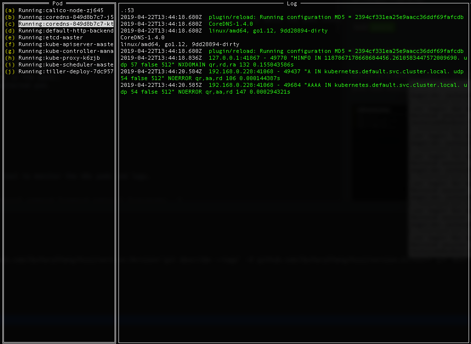

= KCUI - Kubernetes Console User Interface

image:https://travis-ci.org/ZacharyChang/kcui.svg?branch=master[alt="Build Status", link="https://travis-ci.org/ZacharyChang/kcui"]
image:https://goreportcard.com/badge/github.com/ZacharyChang/kcui[alt="Go Report Card", link="https://goreportcard.com/report/github.com/ZacharyChang/kcui"]

== Introduction
KCUI is a simple tool to monitor the k8s pods and logs. From this tool you can easily watch the pods status and logs changing.

== Features
1. Configuration from kubeconfig file (default from $HOME/.kube/config)
2. Change namespace from command params (default as 'default')
3. List current pods in the panel.
4. Tail logs from selected pod.

== Run
....
./kcui
....

=== Usage
....
./kcui --help
NAME:
   KCUI - A simple tool to monitor the k8s pods and logs.

USAGE:
   kcui [global options] command [command options] [arguments...]

VERSION:
   v0.1.2

COMMANDS:
     help, h  Shows a list of commands or help for one command

GLOBAL OPTIONS:
   --kubeconfig value  Path to the kube config. This can be set from environment value 'KUBECONFIG' (default: "/Users/zachary/.kube/config") [$KUBECONFIG]
   --namespace value   Namespace to query. (default: "default")
   --debug             Run with debug mode
   --help, -h          show help
   --version, -v       print the version
....

== Installation
=== macOS
....
curl -Lo kcui https://github.com/ZacharyChang/kcui/releases/download/v0.1.2/kcui_darwin && chmod +x kcui
....

=== Linux
....
curl -Lo kcui https://github.com/ZacharyChang/kcui/releases/download/v0.1.2/kcui_linux && chmod +x kcui
....

=== Windows ( not tested )
....
curl -Lo kcui.exe https://github.com/ZacharyChang/kcui/releases/download/v0.1.2/kcui_windows.exe
....

== Commands

[cols="1v,2v"]
|===
|Key |Description

|kbd:[↑], kbd:[↓]
|Navigate pod list

|kbd:[Enter]
|Select item

|kbd:[Ctrl+q], kbd:[Esc]
|Exit

|===

== TODO
* Multiple containers log support (Not supported yet)
* Log view can be scrolled, and filtered with keywords
* Interactive with pod container, like 'kubectl exec'

== Thanks
* https://github.com/rivo/tview[tview]: Rich interactive widgets for terminal-based UIs written in Go
* https://github.com/kubernetes/client-go[client-go]: Go client for Kubernetes
* https://github.com/astefanutti/kubebox[kubebox]: Terminal and Web console for Kubernetes

